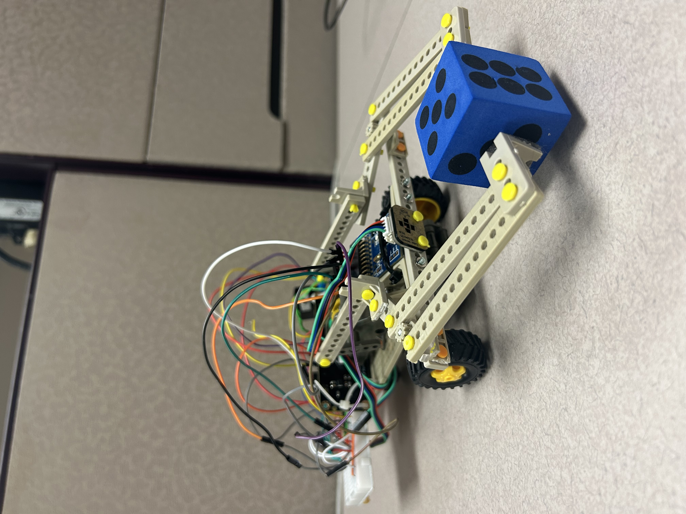

# Tamiya Autonomous Color Seeking Robot

## Overview

A semi-autonomous robot built using a Tamiya chassis and an AVR128DB48 microcontroller. The robot navigates to four colored targets using an onboard compass and RGB color sensor, then uses a front mounted arm mechanism to pick up and carry objects.

## Features

 Autonomous navigation using absolute compass heading
 Color detection using the TCS34725 RGB sensor
 Real time sensor readings displayed on an I2C LCD
 Motor control using an L298N motor driver
 PWM-based speed control
 Front arm mechanism for picking up and carrying objects
 Heading correction to compensate for chassis drift
 Drive calibration to account for sensor and mechanical variation

## Hardware

AVR128DB48 Microcontroller
 Tamiya chassis
 BNO055 orientation sensor
 TCS34725 RGB color sensor
 L298N motor driver
 I2C LCD
 DC motors
 Servo / arm mechanism

## Software

 C
 I2C
 SPI
 PWM
 Embedded Systems

## How It Works

The BNO055 provides the robot with its absolute heading, allowing the robot to maintain a desired direction while navigating. The TCS34725 detects the color of each target using RGB measurements and ratio-based thresholding.

The AVR128DB48 processes the sensor data and controls the motors through the L298N driver. Heading corrections are applied during movement to compensate for chassis drift. Once the robot reaches a target, the front arm mechanism is used to pick up and transport the object.

## Project Structure

```text
src/        Source code
docs/       Project documentation
images/     Project photos
```

## Project Status

Completed — Spring 2026
